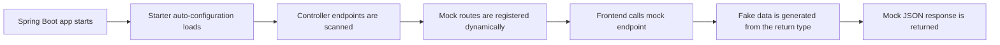

# Mock Endpoints Spring Boot Starter

> A Spring Boot starter for exposing fake API responses from existing controller contracts so frontend teams can start early.

`mock-endpoints-spring-boot-starter` is a Spring Boot library that helps backend teams expose fake API responses before the real service and business logic are finished.

The goal is simple: let frontend developers start building and integrating early without waiting for the backend implementation to be complete.

## Planned badges

Once the library is published, you can add badges like:

- Maven Central version
- Build status
- Test status
- License
- Java version
- Spring Boot compatibility

## Why this library?

In many teams, frontend work gets blocked because:

- the endpoint contract exists, but the service layer is not ready yet
- the controller is defined, but the real data is not available
- backend and frontend need to work in parallel

This starter scans your existing Spring MVC endpoints and registers mock versions of them with fake data, so teams can move faster during development.

## Current idea

If your application has a real endpoint like:

```java
@GetMapping("/users")
public ResponseEntity<List<UserResponse>> getUsers() {
    return ResponseEntity.ok(userService.findAll());
}
```

This library can expose a mock endpoint such as:

```text
GET /users/test
```

and return generated fake data shaped like `UserResponse`.

## Current features

- Spring Boot auto-configuration
- Dynamic registration of mock endpoints from Spring MVC handler mappings
- Fake object generation based on the controller return type
- Support for simple DTOs and nested custom objects
- Support for `List<T>`, `Set<T>`, `Map<K,V>`, and `Optional<T>` responses
- Support for Spring Data `Page<T>` responses
- Better handling for nested generic wrappers such as `Envelope<List<UserDto>>`
- Support for Java records and constructor-based DTOs
- Support for path-variable endpoints such as `/users/{id}`
- Support for multiple endpoint paths mapped from one controller method
- Support for `PATCH` mock endpoints
- Per-endpoint fixed mock responses
- Per-endpoint delay overrides on fixed responses and named scenarios
- Named mock scenarios selected with `?scenario=...`
- Fixed JSON responses from inline strings or classpath resources
- Built-in scenarios such as `empty`, `success`, `large-list`, `error`, and `timeout`
- Built-in flaky scenario support for probabilistic failures
- Scenario selection by query parameter, header, or active Spring profile
- Property-based include and exclude filters for controller-scanned routes
- OpenAPI spec-driven mock endpoint registration
- OperationId-based OpenAPI scenarios
- OpenAPI request-body example scenarios
- Property-based include and exclude filters for OpenAPI-imported routes
- Custom field annotations for better fake data generation
- Smarter default fake data generation based on field names such as `id`, `email`, `phone`, `company`, `url`, and `status`
- Configurable mock endpoint suffix
- Configurable default list size
- Configurable base package for endpoint scanning
- Configurable seeded fake data generation
- Configurable artificial response delay
- Configurable maximum fake-object nesting depth
- Built-in inspection endpoint for registered mock routes
- Ability to disable the feature with properties
- Spring Boot integration tests covering real endpoint registration

## Supported annotations

The library currently includes a few field-level annotations to improve generated fake values:

- `@FakeName`
- `@FakeEmail`
- `@FakeNumber`
- `@FakeDate`
- `@FakePhone`
- `@FakeAddress`
- `@FakeCompany`
- `@FakeUrl`
- `@MockEndpoint`
- `@MockScenario`

Example:

```java
public class UserResponse {

    @FakeName(type = FakeName.NameType.FULL_NAME)
    private String fullName;

    @FakeEmail
    private String email;

    @FakeNumber(min = 18, max = 65)
    private Integer age;
}
```

Endpoint-level override example:

```java
@GetMapping("/catalog")
@MockEndpoint(
    status = 202,
    headers = {"X-Mock-Source=resource"},
    bodyResource = "mock/catalog-response.json",
    delayMs = 250
)
public ResponseEntity<Map<String, Object>> catalog() {
    throw new UnsupportedOperationException("Not implemented yet");
}
```

Named scenarios example:

```java
@GetMapping("/users")
@MockScenario(name = "empty", body = "[]")
@MockScenario(name = "error", status = 503, delayMs = 150,
    body = "{\"error\":\"users service unavailable\"}")
public ResponseEntity<List<UserResponse>> users() {
    throw new UnsupportedOperationException("Not implemented yet");
}
```

Field-name based generation example:

```java
public class CustomerResponse {
    private String userId;
    private String email;
    private String phone;
    private String websiteUrl;
    private String status;
    private String companyName;
}
```

Even without extra annotations, the generator now tries to infer sensible fake values from common field names like these.

You can also force more specific generated values with annotations:

```java
public record ContactResponse(
    @FakePhone String phone,
    @FakeAddress String address,
    @FakeCompany String company,
    @FakeUrl String website
) {
}
```

## Configuration

Example `application.yml`:

```yaml
mock:
  endpoints:
    enabled: true
    suffix: /test
    default-list-size: 5
    base-package: com.example.demo
    seed: 42
    response-delay-ms: 0
    max-depth: 3
    inspection:
      enabled: true
      path: /mock-endpoints
    registration:
      include-paths:
        - /api/**
      exclude-paths:
        - /api/admin/**
      openapi-include-paths:
        - /external/**
      openapi-exclude-paths:
        - /external/internal/**
    scenarios:
      enabled: true
      large-list-size: 20
      error:
        status: 503
        body: '{"error":"mock error scenario"}'
        headers:
          - X-Mock-Scenario=built-in-error
      flaky:
        enabled: true
        failure-rate: 0.35
        statuses:
          - 500
          - 502
          - 503
        headers:
          - X-Mock-Scenario=flaky
        body: '{"error":"mock flaky scenario","status":{status}}'
      timeout:
        status: 504
        delay-ms: 3000
        body: '{"error":"mock timeout scenario"}'
```

Scenario selection happens at request time:

```text
GET /api/users/test?scenario=empty
GET /api/users/test?scenario=large-list
GET /api/users/test?scenario=error
GET /api/users/test?scenario=flaky
GET /api/users/test?scenario=timeout
```

Selection priority is:

1. `scenario` query parameter
2. scenario header such as `X-Mock-Scenario`
3. profile-based default scenario from configuration

Example scenario configuration:

```yaml
mock:
  endpoints:
    scenarios:
      header-name: X-Mock-Scenario
      profile-defaults:
        qa: error
        perf: large-list
      large-list-size: 20
      error:
        status: 503
        body: '{"error":"mock error scenario"}'
      timeout:
        status: 504
        delay-ms: 3000
        body: '{"error":"mock timeout scenario"}'
```

Header-based scenario selection example:

```text
GET /api/users/test
X-Mock-Scenario: empty
```

Built-in inspection endpoint example:

```text
GET /mock-endpoints
```

It returns the currently registered mock routes, their source, and any named scenarios attached to them.

The inspection payload also includes useful summaries such as:

- global response delay
- scenario header name
- built-in scenario names
- source counts for controller-backed and OpenAPI-backed mocks
- per-endpoint default delay metadata

Route filtering example:

```yaml
mock:
  endpoints:
    registration:
      include-paths:
        - /api/users/**
      exclude-paths:
        - /api/users/private/**
```

Filtering behavior:

- `include-paths` and `exclude-paths` apply to controller-scanned endpoints
- `openapi-include-paths` and `openapi-exclude-paths` apply to OpenAPI-imported endpoints
- patterns use Spring-style path matching such as `/api/**` and `/api/users/{id}`
- if no include list is set, matching starts as allow-all and then applies excludes

## OpenAPI mock import

The starter can also register mock endpoints directly from an OpenAPI specification file.

Example configuration:

```yaml
mock:
  endpoints:
    openapi:
      enabled: true
      spec-location: classpath:openapi/test-api.yaml
      use-examples: true
      mock-tag: mocked
```

Behavior:

- if an OpenAPI response example exists, it is used as the mock body
- if no example exists, the starter generates a simple JSON payload from the response schema
- if `mock-tag` is set, only operations with that tag are imported
- request-body examples become operation-specific scenarios such as `searchorders-request-draft`
- response examples can become operation-specific scenarios such as `listorders-compact`
- common framework endpoints such as `/error` and `/actuator/**` are skipped from controller auto-registration by default
- OpenAPI path filters can narrow imported mocks to specific path groups without editing the spec

OpenAPI-generated mock routes still use the normal suffix, for example:

```text
GET /external/orders/test
GET /external/orders/{id}/test
POST /external/orders/search/test
```

Example OpenAPI scenario usage:

```text
GET /external/orders/test?scenario=listorders
GET /external/orders/test?scenario=listorders-compact
POST /external/orders/search/test?scenario=searchorders-request-draft
```

OpenAPI path filtering example:

```yaml
mock:
  endpoints:
    openapi:
      enabled: true
      spec-location: classpath:openapi/test-api.yaml
    registration:
      openapi-include-paths:
        - /external/orders/**
      openapi-exclude-paths:
        - /external/orders/{id}
```

## Getting started

### 1. Add the dependency

Until the library is published, you can build and install it locally:

```bash
mvn clean install
```

Then use it in another Spring Boot project.

When published, the dependency section can look like this:

```xml
<dependency>
    <groupId>io.github.waelhasnaoui1</groupId>
    <artifactId>mock-endpoints-spring-boot-starter</artifactId>
    <version>1.0.1</version>
</dependency>
```

### 2. Enable the feature

The starter auto-configures itself when it is on the classpath and `mock.endpoints.enabled=true`.

If you want explicit opt-in in your application code, you can still add:

```java
@SpringBootApplication
@EnableMockEndpoints
public class DemoApplication {
    public static void main(String[] args) {
        SpringApplication.run(DemoApplication.class, args);
    }
}
```

### 3. Start your application

When the app starts, the library scans your controllers and registers mock endpoints automatically.

## Example use case

Backend team defines the endpoint contract:

```java
@RestController
@RequestMapping("/api/users")
public class UserController {

    @GetMapping
    public ResponseEntity<List<UserResponse>> findAll() {
        throw new UnsupportedOperationException("Not implemented yet");
    }
}
```

Frontend team can already call:

```text
GET /api/users/test
```

and receive fake data while the backend implementation is still under development.

## How it works



In short, the library watches your controller contract, creates matching mock routes with a suffix like `/test`, and returns generated fake data based on the endpoint response type.

## Roadmap

These are the most useful features to build next:

- More advanced field annotations such as `@FakeCity`, `@FakeCountry`, `@FakeUuid`, and `@FakeStatus`
- Deterministic locale support for fake data generation
- Opt-in annotation such as `@MockableEndpoint` for stricter control
- Richer property-based scenario definitions without touching controller code
- OpenAPI request parameter-aware generation so query and path names influence generated values
- Schema-driven response generation that handles more advanced OpenAPI constructs
- Better support for polymorphic and deeply recursive DTO graphs
- More publishing polish such as changelog, release notes, and versioned examples

## Release status

### v1.0.x

- Stabilize endpoint registration
- Improve README and publishing metadata
- Add real integration tests
- Prepare Maven Central publishing

### v1.1

- Path variable support
- `@PatchMapping` support
- Support for multiple paths and methods
- Better generic collection handling

Status: implemented

### v1.2

- Seeded deterministic fake data
- Response delay simulation
- Configurable error scenarios
- Per-endpoint mock customization

Status: implemented

### v1.3

- Spring Data `Page<T>` support
- `@FakePhone`, `@FakeAddress`, `@FakeCompany`, and `@FakeUrl`
- Built-in flaky scenario support
- Mock registry inspection endpoint
- Per-endpoint delay overrides

Status: implemented

### v2.0

- OpenAPI-driven mock generation
- Scenario profiles
- Richer annotation model
- More advanced contract-first frontend support

Status: foundation implemented

### v2.1+

- OpenAPI parameter-aware fake generation
- Richer schema support for complex contracts
- Additional fake-data annotations
- Stronger pagination and wrapper support

## Current limitations

- Very complex generic response trees may still need more refinement
- OpenAPI import currently focuses on response examples and basic schema-to-JSON generation
- OpenAPI import does not yet map schemas to generated Java DTO classes

## Vision

The long-term vision is to make this starter useful for teams that want contract-first collaboration between frontend and backend developers, without forcing them to build every service implementation before UI work can begin.

## Status

This project is still evolving and not fully production-ready yet, but the idea is solid and useful for developer productivity.

The next step is to improve reliability, add tests, and polish the library for publishing.

## Publishing notes

Before publishing publicly, the project should also include:

- a real project URL in `pom.xml`
- license metadata
- SCM metadata
- developer metadata
- a changelog
- integration tests that validate real Spring Boot behavior

## Demo app

A runnable sample lives in [examples/demo-app](D:\Mock Endpoints Spring Boot Starter\examples\demo-app\README.md:1).

It demonstrates:

- generated list and detail mocks
- named scenarios with `?scenario=...`
- fixed JSON loaded from a classpath resource
